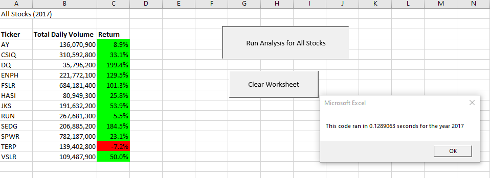
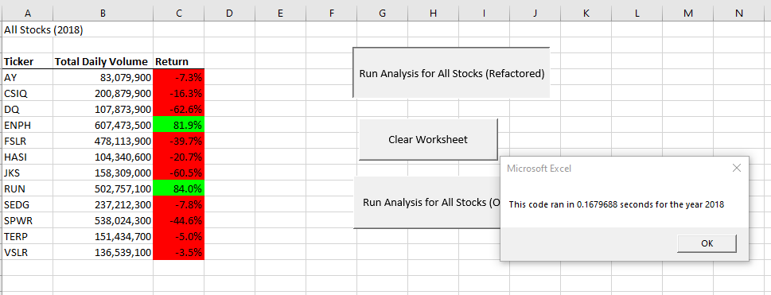
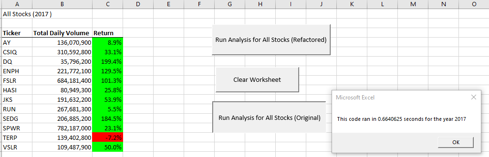
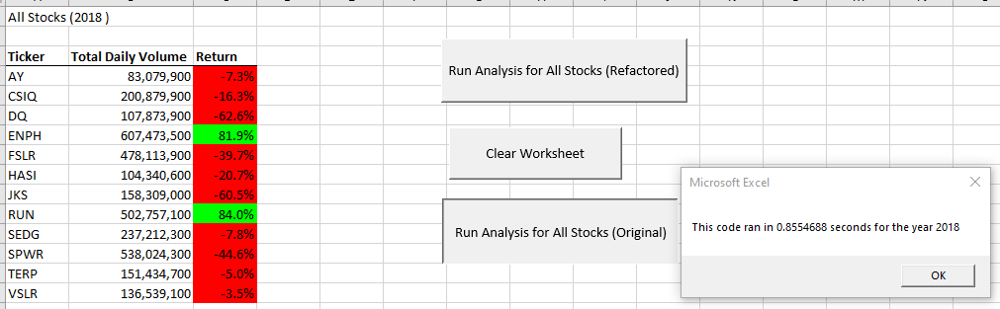

# 
# Module 2 Challenge- _Deliverable 2_

This written analysis contains three sections:

**1. Overview of Project**

**2. Results**

**3. Summary**
 
## 1. Overview of Project

The aim of the analysis was to provide actionable insights to Steve which would help inform his parents choose the right *green* stocks to invest in. Steve's parents are passionate about green technology and were initially emotional about their investment strategy. However Steve prefers a much more data-driven approach and has come up with a dataset which captures the historical performance of multiple green-energy stocks. This analysis of the dataset would help Steve, who is a recent finance grad, determine what are the right stocks to invest in going forward.

The analysis involved looking at historical trading volume and positions of **12** green-energy companies over a two year period from 2017 to 2018.

## 2. Results

### **a. Analysis of Stock Performance between 2017 and 2018:**

The aim of this section of the analysis was to compare the performance of the stocks in 2017 vs 2018 to suggest the optimal investment strategy to Steve's parents.

Firstly, reveiwing the overall perfomance from the images below, it is apparent that the performance of the overall sector had deteriorated in 2018 compared to 2017. The stock prices have largely fallen across the board in 2018 meaning the sector seems to be in a tough spot. Additionally, the returns seem to be extremely volatile which suggests that the industry has not matured yet and there is risk associated with it.

However, looking at the individual stocks, `RUN` is the only stock which has shown positive and growing returns in 2017 and 2018. Another stock which has performed well is `ENPH` which has shown positive returns in both 2017 and 2018 although the rate of return has fallen a little. The rest of the stocks show negative returns in 2018 and should likely be avoided for investment purposes based on the data.





Thus, based on the dataset, Steve's parents should look at investing their funds in either or both `ENPH` or `RUN` with the understanding that the sector is still maturing and there are inherent risks.

### **b. Comparing Execution times of the Original and Refactored Scripts**

The analysis initially involed writing an Original script using `Nested-FOR loops` to provide the output. This code ran with processing times of between **0.66 to 0.85 secs.** With this approach the counter variable was assigned varying values based on the `Nested-FOR loop` and the output was captured within the loop being ran. 

Consequently, this original code was Refactored and the structure was slighly altered to create three output arrays which were assigned with the output for each ticker value. The output of these arrays were published at the end on the code. The processing times with the refactored code was between **0.12 to 0.16 secs** or almost **5 times faster than the original code**. The images of the Refactored run with the processing time are in the earlier section above while the output with the original code is below:





Additionally, the code-blocks comparing the two approaches are below:

- Original Code block with `NESTED-FOR loops` and `COUNTER`

```
 'Creating for loop to run through all the tickers and resetting total volume for each ticker
    For i = 0 To 11
       ticker = tickers(i)
       totalVolume = 0
           Worksheets(yearValue).Activate
       'Creating nested loop starting from the second row as the first row is a header to consider each line item for a particular ticker
       For j = 2 To RowCount
          If Cells(j, 1).Value = ticker Then
            '5a) Get total volume for current ticker
               totalVolume = totalVolume + Cells(j, 8).Value

           End If
           '5b) get starting price for current ticker
           If Cells(j - 1, 1).Value <> ticker And Cells(j, 1).Value = ticker Then

               startingPrice = Cells(j, 6).Value

           End If

           '5c) get ending price for current ticker
           If Cells(j + 1, 1).Value <> ticker And Cells(j, 1).Value = ticker Then

               endingPrice = Cells(j, 6).Value

           End If
       Next j
       '6) Output data for current ticker
       Worksheets("All Stocks Analysis").Activate
       Cells(4 + i, 1).Value = ticker
       Cells(4 + i, 2).Value = totalVolume
       Cells(4 + i, 3).Value = endingPrice / startingPrice - 1

   Next i
```

- Original Code block with separate `Output arrays`

```
'1b) Create three output arrays
    
    Dim tickerVolumes(12) As Long
    Dim tickerStartingPrices(12) As Single
    Dim tickerEndingPrices(12) As Single
    
    '2a) Create a for loop to initialize the tickerVolumes to zero and to loop through all tickers
      
    For tickerIndex = 0 To 11
    
    tickerVolumes(tickerIndex) = 0
                
    '2b) Loop over all the rows in the spreadsheet from the second row as the first row is a header.
        For i = 2 To RowCount
    
     '3a) Counter to increase volume for current ticker
       
            If Cells(i, 1).Value = tickers(tickerIndex) Then
                
                tickerVolumes(tickerIndex) = tickerVolumes(tickerIndex) + Cells(i, 8).Value
            
            End If
     
     '3b) Check if the current row is the first row with the selected tickerIndex then assign the corresponding closing price as the Starting price in the array
            If Cells(i - 1, 1).Value <> tickers(tickerIndex) And Cells(i, 1).Value = tickers(tickerIndex) Then
                tickerStartingPrices(tickerIndex) = Cells(i, 6).Value
            End If
        
        '3c) check if the current row is the last row with the selected tickerIndex then assign the corresponding closing price as the Ending price in the array
            If Cells(i + 1, 1).Value <> tickers(tickerIndex) And Cells(i, 1).Value = tickers(tickerIndex) Then
                tickerEndingPrices(tickerIndex) = Cells(i, 6).Value
            End If
        
            
        '3d Increase the tickerIndex if the current row is the last row of the ticker
            If Cells(i + 1, 1).Value <> tickers(tickerIndex) And Cells(i, 1).Value = tickers(tickerIndex) Then
                tickerIndex = tickerIndex + 1
            End If
           
        Next i
    
    Next tickerIndex
    

    '4) Loop through your arrays to output the Ticker, Total Daily Volume and Return from the four arrays. Return is calculated from the starting and closing price.
    '' The output is assigned from the fourth row onwards as the third row is header
    
    For tickerIndex = 0 To 11
        
        Worksheets("All Stocks Analysis").Activate
        Cells(4 + tickerIndex, 1).Value = tickers(tickerIndex)
        Cells(4 + tickerIndex, 2).Value = tickerVolumes(tickerIndex)
        Cells(4 + tickerIndex, 3).Value = tickerEndingPrices(tickerIndex) / tickerStartingPrices(tickerIndex) - 1
        
    Next tickerIndex
```

## 3. Summary

### a. What are the advantages and disadvantages of refactoring a code?

**Advantages:**

- The refactored code typically runs faster than the original code and can have added benefit of greater stability and accuracy compared to the original one.

- The refactored code also provides the oppurtinity to find bugs and review the structure of the code to make it more streamlined and in the process helps understand the layout of the code better.

**Disadvantages:**

- The refactoring process is both time and resource intensive with a lot of trial and error involved. The structure of the initial code needs to be understood at the beginning. Thus, the process is time-intensive with no benefit in accuracy compared to the earlier code.

- Finalizing the refactored code also involves a change in approach which might unintentionally reduce some functionality or stability from the original code. That is why it is critical to minutely understand the details of the original code before embarking on the refactoring journey.

### b. How do these pros and cons apply to refactoring the original VBA script?

While refactoring the original VBA,

**Pros**

- The refactored code ran **5 times faster than the original code. (0.12s vs 0.66 s)** It is apparent that the refactored code was more efficient and faster than the original code.

- There was some oppurtunity to debug and structure the code better as all the variables were defined with `Dim` and relevant comments were added to make the code more structured. 

**Cons**

- The refactored code took atleast **2 hours** to perfect. This was due to the fact that there were a lot of trial and error involved as the structure of the initial code needed to be understood at the beginning.