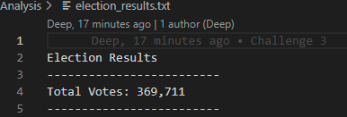
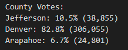
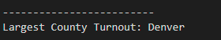
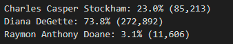
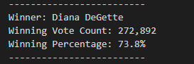

# 
# Module 3 Challenge- _Deliverable 3_

This written analysis contains three sections:

**1. Overview of Election Audit**

**2. Election-Audit Results**

**3. Election-Audit Summary**
 
## 1. Overview of Election Audit

The aim of the analysis was to provide actionable insights to Colorado Board of Elections employee Tom, in an election audit of a US Congressional precinct in Colorado. Tom's manager, Seth has insisted using a Python code which could be repurposed to be used in other elections as well. The aim of the analysis is to validate the total votes cast by a candidate in a specific county and to infer the largest county in terms of votes cast and find the winning candidate in terms of total and percentage of votes cast. The results would then be submitted to the election commission.

The analysis involved looking at over **360,000** ballots across several counties and candidates in the election.

## 2. Election-Audit Results

### **a. How many votes were cast in this congressional election?**

As shared in the image below, the total eligible votes cast in the election was 369,711 votes.



A for-loop with a counter was created to count the total number of votes from the records excluding the header row.

```
 # Read the header
    header = next(reader)

    # For each row in the CSV file.
    for row in reader:

        # Add to the total vote count
        total_votes = total_votes + 1
```

### **b. Provide a breakdown of the number of votes and the percentage of total votes for each county in the precinct:**

The breakup of the number of votes and the percentage of votes in each county is as below:



The code that was used to determine this is below.A for loop was generated to review the entire data and and counter was used to keep track of the count of the votes for each county after which the percentage was deduced.

```
    # 6a: Write a for loop to get the county from the county dictionary.
    for county_name in county_votes:

        # 6b: Retrieve the county vote count.
        vote_county = county_votes[county_name]

        # 6c: Calculate the percentage of votes for the county.
        county_vote_percentage = float(vote_county)/float(total_votes) * 100

         # 6d: Print the county results to the terminal.
        county_results = (
            f"{county_name}: {county_vote_percentage:.1f}% ({vote_county:,})\n")
        print(county_results)
```

### **c. Which county had the largest number of votes?**

From the breakup above, we can infer that Denver county had the largest number of votes, making up 82.8% of the total votes cast.



### **d. Provide a breakdown of the number of votes and the percentage of the total votes each candidate received:**

The breakup of the number of votes and the percentage of votes cast by each candidate is as below:



### **e. Which candidate won the election, what was their vote count, and what was their percentage of the total votes?**

The winning candidate was Diana DeGette who got over 272,000 votes and had 73.8% of the total votes cast. (*image below*)




## 3. Election-Audit Summary

One of the reasons why this script was written in Python was to ensure relatively easy repurposing of this code to other elections as well. As long as the data is structured in a relatively similar format, the code can be lifted and landed to be used for other use-cases as well. A couple of examples of the slight modification that may be needed for other elections are below,

### a. Ensure the correct colums are captured for the candidate name and county:

Currently the county and the candidate names are in the second and third column of the sheet respectively. As a result the code referes to these columns while populating the counter (*code block below*)

```
  # Get the candidate name from each row.
        candidate_name = row[2]

        # 3: Extract the county name from each row.
        county_name = row[1]
```
If this format is changed, we'd have to ensure the appropriate colums are selected and the code is modified accordingly. For eg, column A is 0, column B is 1 and so on.

### b. Ensure that the appopriate file structure is maintained and reflected in the code 

Currently, the data `election_results.csv` is housed in the resources folder which lies in the same path as the Python code. Similarly the output `election_results.txt` file that would be shared with the election commission is housed in the `Analysis` folder in the same path as the code. If these files are to be housed elsewhere we need to ensure that the path is appopriately relected in the code block below:
```
# Add a variable to load a file from a path.
file_to_load = os.path.join("Resources","election_results.csv")
# Add a variable to save the file to a path.
file_to_save = os.path.join("Analysis","election_results.txt")
```